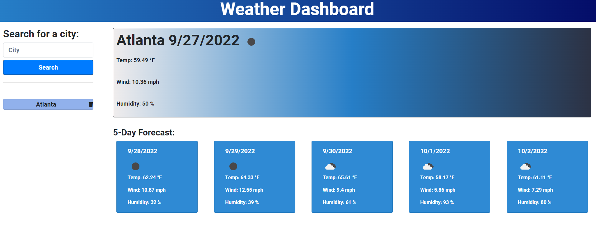
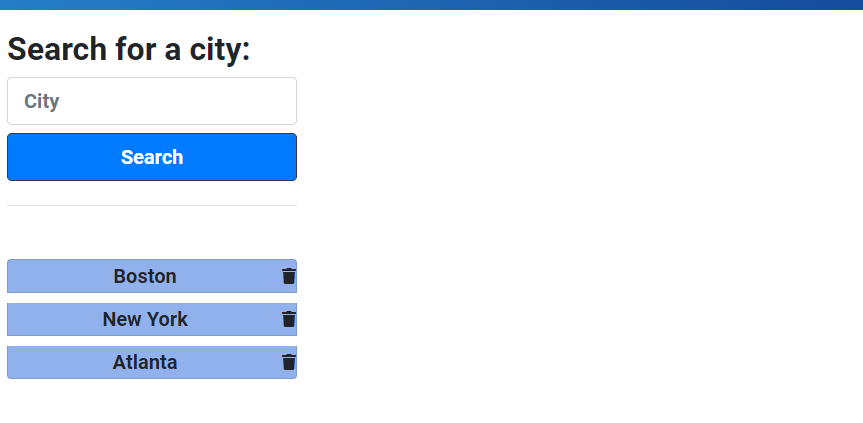

# Weather-Tracker
## Description
 
This project allows a user to search a city name and be presented with the current weather as well as a 5 day weather forecast. It remembers the previous search history of the user to allow for buttons to quickly navigate to those cities again.
## Installation

N/A

## Usage

Follow this [link](https://josephfanderson.github.io/Weather-Tracker) to be taken to the webpage. Once there you can search for a city by name. Once that is done the current weather and 5 day forecast will populate, and the city search will be displayed as a button below the search bar.

Clicking on the new buttons under search will research the city. This data is also saved locally and populated upon a users return to the application. The trash icon on click will delete the city from the search history buttons

## Credits

Third Party APIs used 
 - Bootstrap
 - Font Awesome
 - Google Fonts
 - JQuery
 - Moment.js

 Server Side APIs used
 -OpenWeatherMap

## License

N/A
